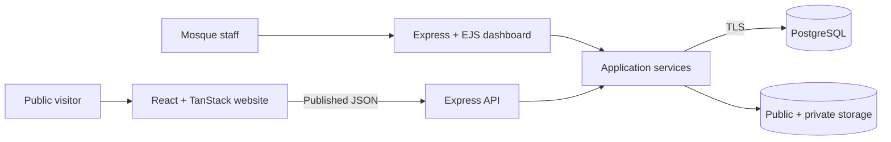
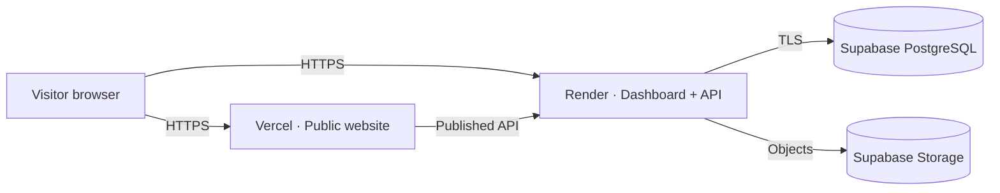

<div align="center">


# Mosque Management System

### Modern, bilingual mosque administration—from prayer times to accountable finance

One connected platform for a public mosque website, community records, prayer schedules, donations, accounts, programs, welfare, staff, assets, documents, and daily operations.

[](https://mosque-management-system-bd.vercel.app/)
[](https://mosque-management-admin.onrender.com/)
[](https://mosque-management-admin.onrender.com/healthz)

[](https://nodejs.org/)
[](https://www.postgresql.org/)
[](https://react.dev/)
[](https://www.typescriptlang.org/)
[](https://expressjs.com/)
[](https://tailwindcss.com/)
[](#-quality-and-testing)
[](LICENSE)

**বাংলা + English · Responsive UI · Light + Dark themes · Secure RBAC · Public website + Admin dashboard**

[Live demo](#-live-demonstration) · [Capabilities](#-platform-capabilities) · [Architecture](#-architecture) · [Quick start](#-quick-start) · [Security](#-security) · [Deployment](#-deployment)

</div>

---

## ✨ Overview

Mosque Management System is a reusable full-stack platform for mosques and Islamic community organizations. It combines two connected experiences:

| Experience | Purpose |
|---|---|
| **Public mosque website** | Prayer information, announcements, events, programs, gallery, staff, Janaza notices, donations, and community contact |
| **Management dashboard** | Members, finance, operations, approvals, publishing, reporting, governance, staff, inventory, documents, and security |

Names, branding, contact details, prayer schedules, donation accounts, and published content are installation-specific and editable from the dashboard. The repository stays a generic **Mosque Management System**, while each mosque can present its own identity.

## 🚀 Live demonstration

| Experience | Link | Access |
|---|---|---|
| 🌐 Public website | [Launch the live mosque website](https://mosque-management-system-bd.vercel.app/) | Public |
| 🕌 Management dashboard | [Open the administration demo](https://mosque-management-admin.onrender.com/) | Demo credentials supplied by the owner |
| 💚 Service health | [Check API and database readiness](https://mosque-management-admin.onrender.com/healthz) | Public JSON status |

> The portfolio uses fictional data. The demo account is enforced as read-only on the server. Render's free service can sleep after inactivity, so its first request may take about a minute.

## 🧩 Platform capabilities

### Public website

- Prayer start, jamaat, and waqt-end information
- Sahri and Iftar cards with prohibited prayer periods
- Date-wise calendar with recurring mosque events
- Announcements, programs, classes, staff, gallery, FAQs, and Janaza notices
- Public donation and contact submissions
- Bangla/English switching with responsive light and dark themes
- Dashboard-controlled drafts, review, scheduling, expiry, publishing, and archives

### Community and operations

- Detailed member, family, address, occupation, and membership records
- Member cards, printable profiles, account ledgers, search, filters, and exports
- Deceased-person and Janaza management
- Programs, attendance, classes, and facility bookings
- Staff attendance, payroll, committees, meetings, decisions, and minutes
- Tasks, checklists, templates, recurrence, notifications, assets, and maintenance
- Suppliers, procurement, inventory, protected documents, and archives

### Finance and accountability

- Donations, collections, receipts, pledges, and monthly payments
- Expenses, vouchers, budgets, and multi-step approvals
- Cash, bank, and mobile-wallet ledgers
- Treasury transfers, reconciliation, and closed accounting periods
- Loans, repayments, welfare, supplier, payroll, and maintenance disbursements
- Traceable cancellations, reversals, audit logs, and accountability reporting

## 🛡️ Designed for real workflows

| Capability | Implementation |
|---|---|
| **Bilingual interface** | Bangla and English across the public site and dashboard |
| **Responsive experience** | Mobile, tablet, and desktop layouts with accessible navigation |
| **Role-based access** | Administrator, collector, viewer, module permissions, and hardened demo role |
| **Financial safeguards** | Approval separation, balance validation, period guards, reversals, and history |
| **Website governance** | Draft, review, publish, schedule, expire, archive, restore, and publication history |
| **Portfolio safety** | Full-module demo visibility with all mutations blocked server-side |
| **Storage flexibility** | Local development storage or Supabase public/private object storage |
| **Release readiness** | Environment validation, health checks, migrations, tests, and backup tooling |

## 🎨 Technology stack

<p>
  
  
  
  
  
  
  
  
</p>

| Layer | Technologies |
|---|---|
| Public frontend | React 19, TypeScript, TanStack Start, Vite, Tailwind CSS |
| Admin application | Node.js, Express, EJS, Bootstrap, custom design system |
| Data layer | PostgreSQL, Knex migrations and seeds |
| Authentication | Express Session, PostgreSQL session store, bcrypt |
| Application security | CSRF protection, Helmet, rate limiting, RBAC, audit logging |
| Testing | Jest, Supertest |
| Cloud portfolio | Vercel, Render, Supabase, GitHub Actions |

## 🏗️ Architecture



Administrative pages are server-rendered and protected by authentication, CSRF validation, permissions, and PostgreSQL-backed sessions. Business rules live in service modules rather than templates or route handlers.

## ⚡ Quick start

### Requirements

- Node.js 20 or 22
- npm
- PostgreSQL 14 or newer

```bash
git clone https://github.com/EganStark/mosque_management_system_bd.git
cd mosque_management_system_bd
npm install
```

Create `.env` from [.env.example](.env.example), configure it, then run:

```bash
npm run db:setup
npm run migrate
npm run seed
npm run dev
```

Open `http://localhost:3000` and use the administrator credentials from `.env`.

Launch the public website in a second terminal:

```bash
cd landing-page
npm install
```

Create `landing-page/.env`:

```env
VITE_API_URL=http://localhost:3000/api
```

```bash
npm run dev
```

Open the Vite URL, normally `http://localhost:5173`.

## ⚙️ Configuration

| Variable | Purpose |
|---|---|
| `DATABASE_URL` | PostgreSQL connection |
| `SESSION_SECRET` / `CSRF_SECRET` | Independent application secrets |
| `SUBMISSION_HASH_SECRET` | Public-submission fingerprint secret |
| `ADMIN_USERNAME` / `ADMIN_PASSWORD` | Private initial administrator credentials |
| `LANDING_PAGE_ORIGIN` | Origin allowed to access the public API |
| `LANDING_PAGE_URL` | Public website URL shown by the dashboard |
| `STORAGE_PROVIDER` | `local` or `supabase` |
| `DEMO_MODE` | Enables the hardened portfolio account |
| `DEMO_USERNAME` / `DEMO_PASSWORD` | Separate public read-only credentials |
| `DEMO_DATA_ENABLED` | Seeds an idempotent fictional demonstration dataset |

Supabase variables are required only for Supabase storage. Service-role credentials must stay server-side and must never use a `VITE_` prefix.

## 🧪 Quality and testing

- **64/64 backend integration tests passing**
- **0 backend production dependency vulnerabilities**
- Landing-page production build passing
- Production environment and storage preflight validation
- Isolated test database enforcement

```bash
npm run test:db
npm test
npm audit --omit=dev
cd landing-page
npm run lint
npm run build
```

## 🔐 Security

- bcrypt password hashing and server-side PostgreSQL sessions
- CSRF validation, Helmet headers, rate limits, and secure cookies
- Server-enforced route permissions and role capabilities
- Approval, reversal, and audit history for financial mutations
- Authenticated access to private documents
- Inert read-only public demo role when enabled
- Production rejection of placeholder secrets and unsafe configuration

> Never publish `.env`, database credentials, secret keys, administrator credentials, or real mosque/member/financial data.

## ☁️ Deployment



| Component | Live URL |
|---|---|
| Public website | https://mosque-management-system-bd.vercel.app/ |
| Admin dashboard and API | https://mosque-management-admin.onrender.com/ |
| Readiness endpoint | https://mosque-management-admin.onrender.com/healthz |

See [FREE_DEPLOYMENT.md](FREE_DEPLOYMENT.md) for the complete guide. Free tiers have sleep, usage, retention, and availability limitations and are not production infrastructure.

## 📁 Project structure

```text
.
├── docs/assets/         # Repository branding assets
├── landing-page/        # React + TanStack Start public website
├── migrations/          # PostgreSQL schema and safeguards
├── seeds/               # Initial configuration and fictional demo data
├── scripts/             # Setup, release, and backup utilities
├── src/
│   ├── config/          # Database and environment configuration
│   ├── middleware/      # Authentication, security, governance, uploads
│   ├── public/          # Dashboard CSS, JavaScript, and uploads
│   ├── routes/          # Dashboard pages and public API
│   ├── services/        # Business logic and data access
│   └── views/           # EJS dashboard templates
├── storage/             # Local private documents and backups
└── tests/               # Jest + Supertest integration suite
```

## 🗺️ Roadmap

- Curated production screenshots and a guided demo tour
- Installation-level branding wizard
- Automated browser and accessibility testing
- Additional notification gateway integrations
- Containerized self-hosting option

## 📄 License

Distributed under the [MIT License](LICENSE).

---

<div align="center">

Built as a reusable digital foundation for mosque administration and community service.

**[Explore the website](https://mosque-management-system-bd.vercel.app/) · [Open the dashboard](https://mosque-management-admin.onrender.com/) · [View the source](https://github.com/EganStark/mosque_management_system_bd)**

</div>
