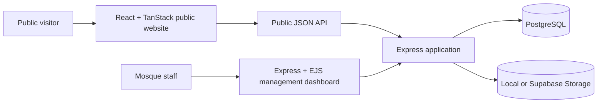

<div align="center">

# Mosque Management System

### A bilingual digital platform for modern mosque administration

Manage the public website, community, prayer schedule, donations, accounts, programs, welfare, staff, assets, documents, and daily operations from one secure workspace.

[](https://nodejs.org/)
[](https://www.postgresql.org/)
[](https://react.dev/)
[](#quality-and-testing)
[](LICENSE)

**Bangla + English · Responsive UI · Light + Dark themes · Secure RBAC · Public website + Admin dashboard**

[Overview](#overview) · [Features](#platform-capabilities) · [Architecture](#architecture) · [Quick start](#quick-start) · [Security](#security) · [Deployment](#deployment)

</div>

---

## Overview

Mosque Management System is a reusable, full-stack platform built for mosques and Islamic community organizations. It combines two connected experiences:

| Experience | Purpose |
|---|---|
| **Public mosque website** | Prayer information, announcements, events, programs, gallery, staff, Janaza notices, donations, and community contact |
| **Management dashboard** | Members, finance, operations, approvals, publishing, reporting, governance, staff, inventory, documents, and security |

The mosque name, branding, contact details, prayer schedule, donation accounts, and public content are installation-specific and editable from the dashboard. The repository therefore remains a generic **Mosque Management System**, while each organization can present its own identity.

> **Portfolio status:** the application is ready for a demonstration deployment. Live links and production screenshots will be added after hosting is connected.

## Platform capabilities

### Public website

- Accurate prayer start, jamaat, and waqt-end information
- Sahri and Iftar cards with prohibited prayer periods
- Date-wise event calendar with recurring events
- Announcements, programs, classes, staff, gallery, FAQs, and Janaza notices
- Public donation and contact submissions
- Bangla/English language switching
- Responsive light and dark themes
- Dashboard-controlled drafts, reviews, scheduling, expiry, publishing, and archives

### Community management

- Detailed member and family profiles
- Hierarchical addresses, occupations, references, photos, and membership status
- Member cards, printable profiles, account ledgers, search, filtering, and export
- Monthly contributions and payment history
- Deceased-person and Janaza management
- Public message and donation inboxes

### Finance and accountability

- Donations, collections, receipts, pledges, and monthly payments
- Expenses, vouchers, budgets, and approval workflows
- Cash, bank accounts, and mobile-wallet ledgers
- Treasury transfers, reconciliation, and accounting-period controls
- Loans, repayments, cancellations, and traceable reversals
- Welfare, supplier, payroll, and maintenance disbursement approvals
- Operational, community, finance, and accountability reports

### Operations and governance

- Programs, classes, attendance, and facility bookings
- Staff attendance, payroll, committees, meetings, minutes, and decisions
- Tasks, checklists, reusable templates, recurrence, and notifications
- Assets, maintenance requests, suppliers, procurement, and inventory
- Documents, templates, reference numbers, protected attachments, and archives
- Global search, data-quality checks, audit logs, backups, and security controls

## Designed for real workflows

| Capability | Implementation |
|---|---|
| **Bilingual interface** | Bangla and English across the public site and management dashboard |
| **Responsive experience** | Mobile, tablet, and desktop layouts with accessible navigation |
| **Role-based access** | Administrator, collector, viewer, module permissions, and a hardened demo role |
| **Financial safeguards** | Approval separation, balance validation, closed-period guards, reversals, and audit history |
| **Website governance** | Draft, review, publish, schedule, expire, archive, restore, and publication history |
| **Portfolio demo safety** | Full-module read visibility with all state-changing requests blocked server-side |
| **Storage flexibility** | Local development storage or Supabase public/private object storage |
| **Release readiness** | Environment validation, health checks, migration checks, tests, and backup tooling |

## Technology stack

| Layer | Technologies |
|---|---|
| Public frontend | React 19, TypeScript, TanStack Start, Vite, Tailwind CSS |
| Admin application | Node.js, Express, EJS, Bootstrap, custom design system |
| Data layer | PostgreSQL, Knex migrations and seeds |
| Authentication | Express Session, PostgreSQL session store, bcrypt |
| Application security | CSRF protection, Helmet, rate limiting, RBAC, audit logging |
| Testing | Jest, Supertest |
| Optional cloud services | Vercel, Render, Supabase, GitHub Actions |

## Architecture



The public website consumes published data through the Express API. Administrative pages are server-rendered and protected by authentication, CSRF validation, permissions, and PostgreSQL-backed sessions. Business rules live in service modules rather than templates or route handlers.

## Quick start

### Requirements

- Node.js 20 or 22
- npm
- PostgreSQL 14 or newer

### 1. Clone and install the backend

```bash
git clone https://github.com/EganStark/mosque_management_system_bd.git
cd mosque_management_system_bd
npm install
```

### 2. Create the environment file

Windows PowerShell:

```powershell
Copy-Item .env.example .env
```

macOS or Linux:

```bash
cp .env.example .env
```

Update `.env` with your PostgreSQL URL, independent random secrets, and private administrator credentials.

### 3. Prepare the database

```bash
npm run db:setup
npm run migrate
npm run seed
```

### 4. Start the management dashboard

```bash
npm run dev
```

Open **http://localhost:3000** and sign in using `ADMIN_USERNAME` and `ADMIN_PASSWORD` from `.env`.

### 5. Start the public website

In a second terminal:

```bash
cd landing-page
npm install
```

Create `landing-page/.env`:

```env
VITE_API_URL=http://localhost:3000/api
```

Then run:

```bash
npm run dev
```

Open the URL printed by Vite, normally **http://localhost:5173**.

## Configuration

The complete safe template is available in [.env.example](.env.example).

| Variable | Purpose |
|---|---|
| `DATABASE_URL` | PostgreSQL application connection |
| `SESSION_SECRET` | Independent session-signing secret |
| `CSRF_SECRET` | Independent CSRF secret |
| `SUBMISSION_HASH_SECRET` | Public-submission fingerprint secret |
| `ADMIN_USERNAME` / `ADMIN_PASSWORD` | Private initial administrator credentials |
| `LANDING_PAGE_ORIGIN` | Origin allowed to access the public API |
| `LANDING_PAGE_URL` | Public website URL presented by the dashboard |
| `STORAGE_PROVIDER` | `local` or `supabase` |
| `DEMO_MODE` | Enables the hardened public portfolio account |
| `DEMO_USERNAME` / `DEMO_PASSWORD` | Separate public read-only demo credentials |
| `DEMO_DATA_ENABLED` | Seeds an idempotent, entirely fictional portfolio dataset |

Supabase variables are required only when `STORAGE_PROVIDER=supabase`. Service-role credentials must remain server-side and must never use a `VITE_` prefix.

## Useful commands

| Command | Description |
|---|---|
| `npm run dev` | Start the backend with automatic restart |
| `npm start` | Start the backend normally |
| `npm run db:setup` | Create the configured local database |
| `npm run migrate` | Apply pending migrations |
| `npm run migrate:rollback` | Roll back the latest migration batch |
| `npm run seed` | Apply idempotent initial data |
| `npm test` | Run the backend integration suite |
| `npm run release:check-env` | Validate production configuration |
| `npm run release:preflight` | Check database, migrations, storage, and credentials |
| `npm run backup:database` | Create a checksummed application-data backup |

Public-website commands run from `landing-page/`:

| Command | Description |
|---|---|
| `npm run dev` | Start the public website locally |
| `npm run lint` | Run ESLint |
| `npm run build` | Produce the Vercel-compatible build |
| `npm run preview` | Preview the production build locally |

## Quality and testing

Current verification status:

- **64/64 backend integration tests passing**
- **0 backend production dependency vulnerabilities**
- **Landing-page production build passing**
- Production environment and storage preflight validation
- Isolated test database enforcement: test database names must end in `_test`

Run backend verification:

```bash
npm run test:db
npm test
npm audit --omit=dev
```

Run public-website verification:

```bash
cd landing-page
npm run lint
npm run build
```

## Security

- Passwords are hashed with bcrypt and never stored as plain text.
- Sessions are server-side and persisted in PostgreSQL.
- State-changing requests require valid CSRF tokens.
- Login and public submission endpoints are rate-limited.
- Route permissions and role capabilities are enforced server-side.
- Financial mutations retain approval, reversal, and audit history.
- Private documents require authenticated downloads.
- The public `demo` role is inert unless explicitly enabled and cannot mutate data.
- Production startup rejects placeholder secrets and unsafe configuration.

> Never publish `.env`, database credentials, service-role keys, private administrator credentials, or real mosque/member/financial data in a portfolio deployment.

## Deployment

The included optional portfolio architecture uses:

| Service | Responsibility |
|---|---|
| Vercel | TanStack Start public website |
| Render | Express management dashboard and API |
| Supabase | Small demonstration PostgreSQL database and object storage |
| GitHub Actions | Optional scheduled database backups |

See [FREE_DEPLOYMENT.md](FREE_DEPLOYMENT.md) for the complete deployment guide. Free-tier services have sleep, usage, retention, and availability limitations and should not be treated as production infrastructure.

## Project structure

```text
.
├── landing-page/       # React + TanStack Start public website
├── migrations/         # PostgreSQL schema and safeguards
├── seeds/              # Initial configuration and optional demo user
├── scripts/            # Setup, release, and backup utilities
├── src/
│   ├── config/         # Database and environment configuration
│   ├── middleware/     # Authentication, security, governance, uploads
│   ├── public/         # Dashboard CSS, JavaScript, and public uploads
│   ├── routes/         # Dashboard pages and public API
│   ├── services/       # Business logic and data access
│   └── views/          # EJS dashboard templates
├── storage/            # Local private documents and backups
└── tests/              # Jest + Supertest integration suite
```

## Roadmap

- One-command fictional demonstration-data reset tooling
- Production screenshots and live portfolio links
- Installation-level branding wizard
- Automated browser and accessibility testing
- Additional notification gateway integrations
- Containerized self-hosting option

## License

Distributed under the [MIT License](LICENSE).

---

<div align="center">

Built as a reusable digital foundation for mosque administration and community service.

</div>
